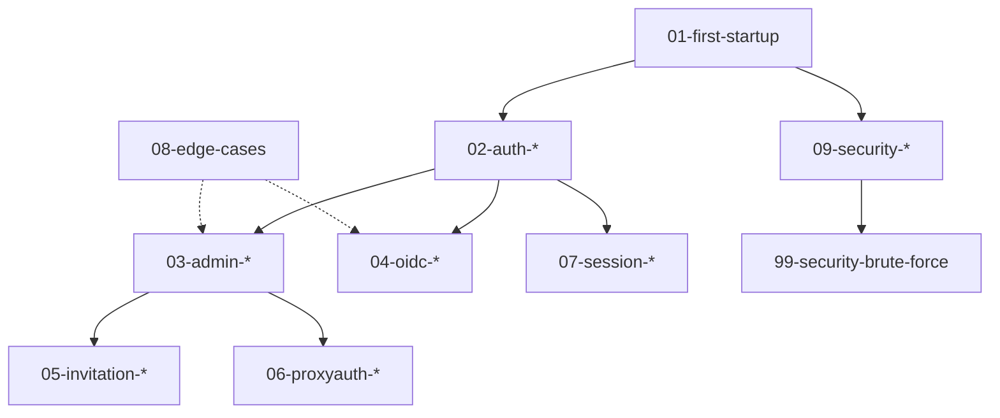

# Goauth E2E 测试流程设计

## 一、测试执行策略

### 1.1 测试文件分类

**基础测试 (Foundation Tests)**
- `01-first-startup.spec.ts` - 首次启动和环境验证
- 执行时机: 最优先执行
- 失败影响: 阻塞所有后续测试

**核心功能测试 (Core Feature Tests)**
- `02-auth-*.spec.ts` - 用户认证相关
- `03-admin-*.spec.ts` - 管理员功能
- `04-oidc-*.spec.ts` - OIDC 流程
- `05-invitation-*.spec.ts` - 邀请系统
- `06-proxyauth-*.spec.ts` - ProxyAuth 功能
- `07-session-*.spec.ts` - 会话管理
- 执行时机: 基础测试通过后并行执行
- 失败影响: 标记相关功能不可用

**安全测试 (Security Tests)**
- `09-security-*.spec.ts` - 各种安全测试
- `99-security-brute-force.spec.ts` - 暴力破解防护
- 执行时机: 核心功能测试后执行
- 失败影响: 阻塞发布

**边界测试 (Edge Case Tests)**
- `08-edge-cases.spec.ts` - 边界情况
- 执行时机: 最后执行
- 失败影响: 记录但不阻塞发布

### 1.2 测试执行顺序

```yaml
# 推荐的测试执行顺序
stages:
  - stage: foundation
    tests:
      - 01-first-startup.spec.ts
    maxParallel: 1
    
  - stage: authentication
    tests:
      - 02-auth-password-change.spec.ts
      - 02-auth-password-reset.spec.ts
      - 02-auth-totp.spec.ts
      - 02-auth-user-settings.spec.ts
    maxParallel: 4
    
  - stage: administration
    tests:
      - 03-admin-basic.spec.ts
      - 03-admin-extended.spec.ts
      - 03-admin-protection.spec.ts
      - 03-admin-batch.spec.ts
      - 03-user-approval.spec.ts
    maxParallel: 5
    
  - stage: oidc
    tests:
      - 04-oidc-basic.spec.ts
      - 04-oidc-flow.spec.ts
      - 04-oidc-pkce.spec.ts
      - 04-oidc-security.spec.ts
      - 04-oidc-refresh.spec.ts
    maxParallel: 5
    
  - stage: invitation
    tests:
      - 05-invitation.spec.ts
      - 05-invitation-edge.spec.ts
    maxParallel: 2
    
  - stage: proxyauth
    tests:
      - 06-proxyauth.spec.ts
      - 06-proxyauth-mfa.spec.ts
      - 06-proxyauth-session.spec.ts
    maxParallel: 3
    
  - stage: session
    tests:
      - 07-session.spec.ts
      - 07-session-termination.spec.ts
    maxParallel: 2
    
  - stage: security
    tests:
      - 09-security-csrf.spec.ts
      - 09-security-headers.spec.ts
      - 09-security-password.spec.ts
      - 09-security-penetration.spec.ts
      - 09-security-token.spec.ts
      - 09-security-xss.spec.ts
      - 99-security-brute-force.spec.ts
    maxParallel: 7
    
  - stage: edge_cases
    tests:
      - 08-edge-cases.spec.ts
    maxParallel: 1
```

## 二、测试数据管理

### 2.1 测试用户策略

```typescript
// 固定测试用户（跨测试共享）
const TEST_USERS = {
  admin: {
    username: 'test-admin',
    password: process.env.TEST_ADMIN_PASSWORD || 'TestAdmin123!',
    email: 'admin@test.local',
    role: 'admin'
  },
  user: {
    username: 'test-user',
    password: process.env.TEST_USER_PASSWORD || 'TestUser123!',
    email: 'user@test.local',
    role: 'user'
  }
};

// 动态测试用户（每个测试生成）
function generateTestUser() {
  const timestamp = Date.now();
  return {
    username: `test-${timestamp}`,
    password: STRONG_PASSWORD,
    email: `test-${timestamp}@test.local`
  };
}
```

### 2.2 测试数据清理策略

**全局清理 (Global Cleanup)**
- 执行时机: 测试套件开始前和结束后
- 清理内容:
  - 删除所有测试创建的用户（用户名包含 `test-`）
  - 删除所有测试创建的分组（名称包含 `test_group` 或 `batch-group`）
  - 删除所有测试创建的客户端（ID 包含 `test_client`）
  - 删除所有测试创建的 ProxyAuth（域名包含测试前缀）
  - 删除所有测试邀请（邮箱包含 `@test.local`）

**局部清理 (Local Cleanup)**
- 执行时机: 每个测试用例结束后
- 清理内容: 该测试用例创建的特定资源

### 2.3 数据隔离策略

```typescript
// 使用唯一前缀标识测试数据
const TEST_PREFIXES = {
  user: 'e2e-user-',
  group: 'e2e-group-',
  client: 'e2e-client-',
  proxyAuth: 'e2e-pa-',
  invitation: 'e2e-inv-'
};

// 时间戳确保唯一性
function generateUniqueName(prefix: string): string {
  return `${prefix}${Date.now()}`;
}
```

## 三、测试环境配置

### 3.1 环境变量

```bash
# .env.test 文件
APP_SERVER_PORT=3001  # 测试端口
APP_DATABASE_PATH=./data/test-goauth.db
APP_OIDC_ISSUER=http://localhost:3001
APP_UI_APPNAME=Goauth-Test

# 测试配置
TEST_ADMIN_PASSWORD=TestAdmin123!
TEST_USER_PASSWORD=TestUser123!
TEST_TIMEOUT=30000  # 测试超时时间(ms)
TEST_RETRY=2        # 失败重试次数

# 浏览器配置
HEADLESS=true
BROWSER=chromium
SLOW_MO=0
```

### 3.2 Playwright 配置

```typescript
// playwright.config.ts 更新建议
import { defineConfig } from '@playwright/test';

export default defineConfig({
  testDir: './',
  timeout: 30000,
  retries: 2,
  workers: 4,  // 并行执行数
  
  reporter: [
    ['list'],
    ['json', { outputFile: 'test-results/results.json' }],
    ['html', { open: 'never' }]
  ],
  
  use: {
    baseURL: process.env.BASE_URL || 'http://localhost:3001',
    trace: 'on-first-retry',
    screenshot: 'only-on-failure',
    video: 'retain-on-failure',
  },
  
  projects: [
    {
      name: 'chromium',
      use: { browserName: 'chromium' },
    },
    // 可选: 添加 Firefox 和 WebKit 测试
    // {
    //   name: 'firefox',
    //   use: { browserName: 'firefox' },
    // },
  ],
  
  // 分阶段执行
  webServer: {
    command: 'cd ../.. && ./bin/goauth serve',
    port: 3001,
    timeout: 120000,
    reuseExistingServer: !process.env.CI,
  },
});
```

## 四、测试依赖管理

### 4.1 测试间依赖关系



### 4.2 共享状态管理

**使用 Fixture 共享状态**
```typescript
// fixture.ts
export { test as base } from '@playwright/test';

// 扩展测试上下文
export const test = base.extend<{
  authenticatedPage: Page;
  adminPage: Page;
  testUser: TestUser;
}>({
  // 自动注入已认证的页面
  authenticatedPage: async ({ page }, use) => {
    await loginAsUser(page);
    await use(page);
  },
  
  // 自动注入管理员页面
  adminPage: async ({ page }, use) => {
    await loginAsAdmin(page);
    await use(page);
  },
  
  // 自动创建测试用户
  testUser: async ({ request }, use) => {
    const user = generateTestUser();
    await request.post('/api/auth/register', { data: user });
    await use(user);
    // 清理在测试中完成
  },
});
```

## 五、CI/CD 集成

### 5.1 GitHub Actions 工作流

```yaml
# .github/workflows/e2e-tests.yml
name: E2E Tests

on:
  push:
    branches: [main, develop]
  pull_request:
    branches: [main]

jobs:
  e2e-tests:
    runs-on: ubuntu-latest
    
    strategy:
      matrix:
        node-version: [18.x]
        browser: [chromium]
    
    steps:
      - uses: actions/checkout@v3
      
      - name: Setup Go
        uses: actions/setup-go@v4
        with:
          go-version: '1.21'
      
      - name: Setup Node.js
        uses: actions/setup-node@v3
        with:
          node-version: ${{ matrix.node-version }}
          cache: 'npm'
          cache-dependency-path: goauth/tests/e2e/package-lock.json
      
      - name: Install dependencies
        working-directory: goauth/tests/e2e
        run: npm ci
      
      - name: Install Playwright browsers
        working-directory: goauth/tests/e2e
        run: npx playwright install --with-deps ${{ matrix.browser }}
      
      - name: Build Goauth
        working-directory: goauth
        run: make build
      
      - name: Run E2E tests
        working-directory: goauth/tests/e2e
        env:
          CI: true
          BASE_URL: http://localhost:3001
        run: npx playwright test --project=${{ matrix.browser }}
      
      - name: Upload test results
        if: always()
        uses: actions/upload-artifact@v3
        with:
          name: test-results-${{ matrix.browser }}
          path: goauth/tests/e2e/test-results/
      
      - name: Upload HTML report
        if: always()
        uses: actions/upload-artifact@v3
        with:
          name: html-report-${{ matrix.browser }}
          path: goauth/tests/e2e/html-report/
```

### 5.2 测试报告

**生成测试报告**
```bash
# 本地生成 HTML 报告
npx playwright test --reporter=html
npx playwright show-report

# CI 中生成 JSON 报告
npx playwright test --reporter=json --output=test-results/results.json
```

## 六、测试维护建议

### 6.1 测试代码规范

1. **清晰的测试命名**
   ```typescript
   // 好的命名
   test('管理员可以创建新的 OIDC 客户端', async ({ page }) => { ... });
   
   // 不好的命名
   test('test1', async ({ page }) => { ... });
   ```

2. **使用 Page Object Model**
   ```typescript
   // pages/AdminPage.ts
   class AdminPage {
     constructor(private page: Page) {}
     
     async navigateToUsersTab() {
       await this.page.click('.tabs button:has-text("用户")');
     }
     
     async createUser(userData: any) {
       // ...
     }
   }
   ```

3. **避免硬编码等待**
   ```typescript
   // 不好
   await page.waitForTimeout(5000);
   
   // 好
   await page.waitForSelector('.user-list', { state: 'visible' });
   ```

### 6.2 测试稳定性提升

1. **合理的重试策略**
   ```typescript
   test.describe.configure({ retries: 2 });
   ```

2. **适当的超时设置**
   ```typescript
   test('慢速操作', async ({ page }) => {
     test.setTimeout(60000);  // 这个测试需要更长时间
     // ...
   });
   ```

3. **优雅的错误处理**
   ```typescript
   try {
     await page.click('button');
   } catch (error) {
     // 记录错误但继续测试
     console.log('Button click failed, trying alternative:', error);
     await page.locator('button').first().click();
   }
   ```

## 七、测试监控和告警

### 7.1 测试失败通知

```yaml
# Slack 通知配置
- name: Notify on failure
  if: failure()
  uses: 8398a7/action-slack@v3
  with:
    status: failure
    fields: repo,message,commit,author,action,eventName,ref,workflow
  env:
    SLACK_WEBHOOK_URL: ${{ secrets.SLACK_WEBHOOK }}
```

### 7.2 测试覆盖率跟踪

```bash
# 生成覆盖率报告
npx playwright test --coverage
npx playwright coverage report
```

## 八、测试优化建议

### 8.1 性能优化

1. **并行执行**
   - 合理设置 workers 数量
   - 使用 `test.describe.configure({ mode: 'parallel' })`

2. **选择性执行**
   ```bash
   # 只运行特定测试
   npx playwright test -g "管理员"
   
   # 只运行特定文件
   npx playwright test 03-admin-basic.spec.ts
   ```

3. **跳过慢速测试**
   ```typescript
   test.skip('慢速测试', async ({ page }) => {
     // 标记为 skip 而不是删除
   });
   ```

### 8.2 资源管理

1. **数据库隔离**
   - 每个测试套件使用独立的数据库
   - 测试后清理所有测试数据

2. **浏览器上下文复用**
   ```typescript
   // 复用认证状态
   test.use({ storageState: 'auth/admin.json' });
   ```

## 九、测试扩展方向

### 9.1 可访问性测试
```typescript
import AxeBuilder from '@axe-core/playwright';

test('页面可访问性检查', async ({ page }) => {
  await page.goto('/');
  const accessibilityScanResults = await new AxeBuilder({ page }).analyze();
  expect(accessibilityScanResults.violations).toEqual([]);
});
```

### 9.2 视觉回归测试
```typescript
test('登录页面视觉测试', async ({ page }) => {
  await page.goto('/#/login');
  await expect(page).toHaveScreenshot('login-page.png');
});
```

### 9.3 性能测试
```typescript
test('登录性能测试', async ({ page }) => {
  const startTime = Date.now();
  await login(page);
  const endTime = Date.now();
  
  expect(endTime - startTime).toBeLessThan(2000);  // 登录应在 2 秒内完成
});
```

---

## 总结

本测试流程设计旨在提供：

✅ **全面覆盖**: 30+ 测试文件覆盖所有核心功能  
✅ **清晰分层**: 基础测试 → 功能测试 → 安全测试 → 边界测试  
✅ **高效执行**: 分阶段并行执行，合理利用资源  
✅ **易于维护**: 清晰的测试结构和命名规范  
✅ **CI/CD 友好**: 完整的自动化集成方案  
✅ **可扩展性**: 支持添加更多测试类型（可访问性、视觉、性能）  

建议按照此流程逐步完善测试体系，确保 Goauth 项目的质量稳定性。
